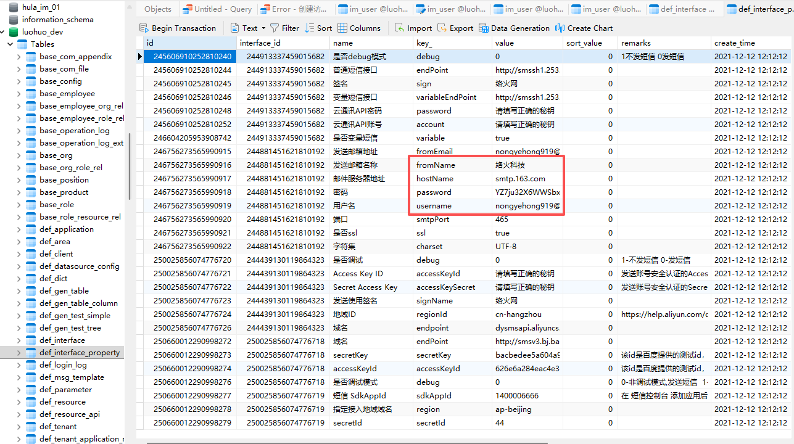
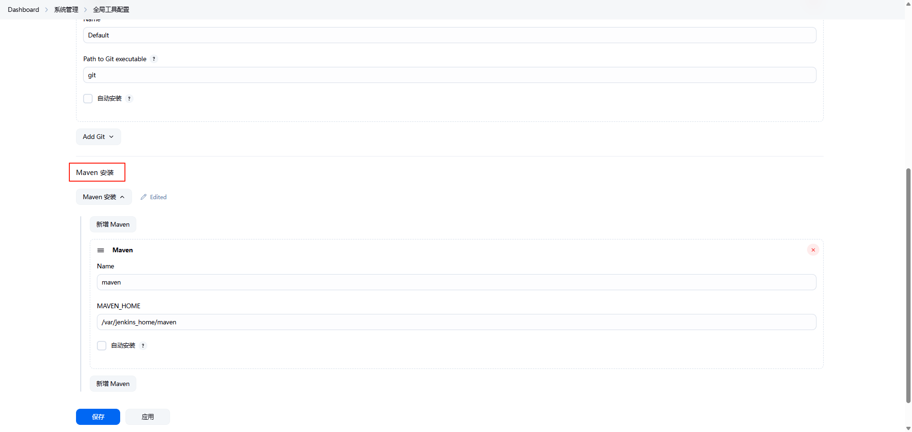
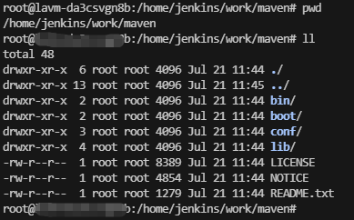
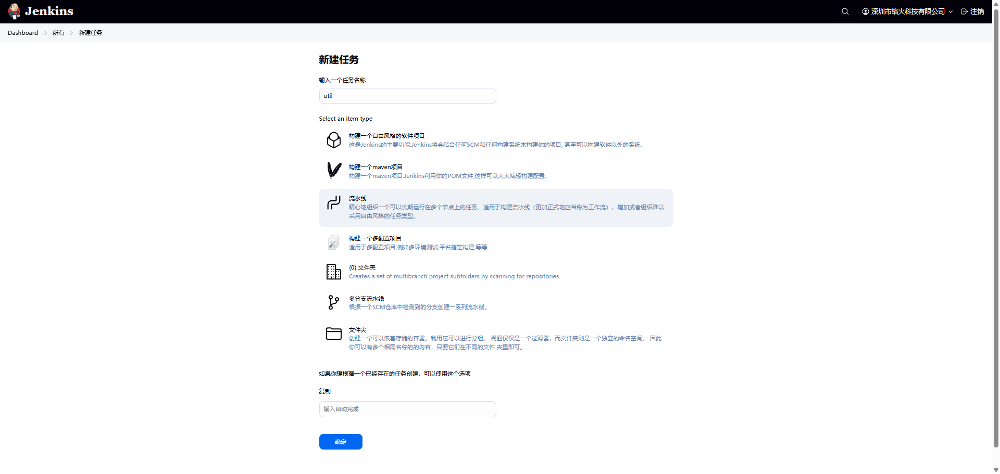
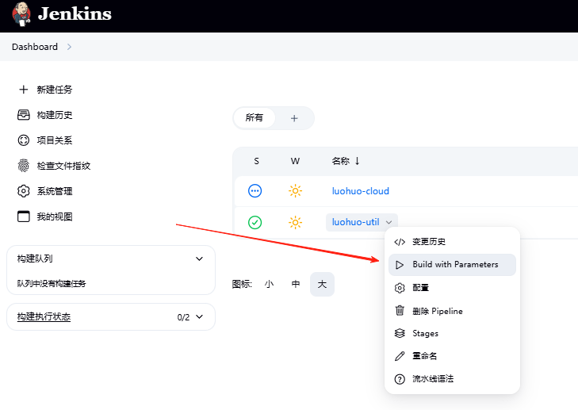
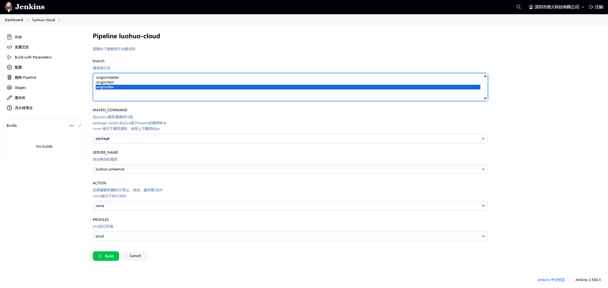
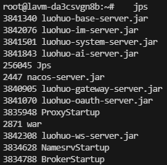

## 📝 修改环境配置

上传目录下的docker文件夹到服务器/home/docker下面, 需要修改env文件夹rocketmq文件夹里面的配置, 特别是[broker.conf](docker/rocketmq/broker/conf/broker.conf)里面brokerIP1的值

## 🛠️ 注册时需要的邮箱功能
- **配置邮箱密钥**: 

## 🛠️ 启动命令
- **提高权限**: sudo chmod -R 777 /home/docker/rocketmq
- **开放端口**: 先去你购买服务器的平台里面的安全组里面放行mysql、redis、rocketmq部署的端口，再去1panel或宝塔下面放行
- **执行命令**: cd /home/docker & docker-compose up -d
- **导入mysql数据库**: install文件夹下面有一个nacos[mysql-schema.sql](mysql-schema.sql)的sql文件，需要导入到数据库里面，不然nacos启动不了
- **重试nacos**: 如果还不行就删了nacos的容器，重新执行 docker-compose up -d

## 🖼️ 效果预览


## 🛠️ 安装项目环境

- **开放端口**: 安全组里面放行jenkins部署的端口，再去1panel或宝塔下面放行, 我这里配置的是20000
- **安装JDK21**: https://download.oracle.com/java/21/latest/jdk-21_linux-x64_bin.tar.gz [安装在宿主机]
- **安装git、maven**: 我机器自带的git、https://maven.apache.org/download.cgi 下载然后上传解压即可 [安装在宿主机]


## 🛠️ jenkins 环境配置
- **查看密码**: docker logs -f jenkins | grep "initialAdminPassword"

- **进入jenkins**: http://ip:20000，输入上一步查看得到的密码，配置各项基础信息
- **安装插件**: 自行选择默认推荐的就行，ant、Gradle等一些没用的插件可以取消勾选
- **下载必选jenkins插件**: http://ip:20000/manage/pluginManager/
   ```
   Git Parameter
   Git plugin
   Maven Integration
   gitee
   Publish Over SSH
   ```
- **系统全局配置**: http://ip:20000/manage/configure 配置环境变量
   ```
   PATH
   /opt/java/openjdk/bin:/usr/local/sbin:/usr/local/bin:/usr/sbin:/usr/bin:/sbin:/bin:/var/jenkins_home/maven/bin:/root/bin
   ```

- **系统全局配置**: http://ip:20000/manage/configure 配置项目地址; 添加凭证时必须选giteeAPI, util、cloud两个项目地址都需要配进去,点击测试链接按钮必须返回成功


- **系统全局配置**: http://ip:20000/manage/configureTools/ 配置jenkins内部maven; 项目环境中下载的maven解压到 /home/jenkins/work 下面




## 🛠️ 创建util、cloud项目流水线

- **创建util**: 输入名称、选择流水线

- **配置util**: 根据步骤，仔细对比这上面的内容

- **创建账号凭证**: 这一步创建的账号是username!!!，注意看是你登录gitee的账号密码。不是apikey!


- **创建cloud**: 输入名称、选择流水线

- **配置cloud**: 根据步骤，仔细对比这上面的内容


## 🛠️ 编译 util、cloud

- **install util**: 因为cloud依赖 util, 所以先安装util到maven本地仓库


- **install cloud**: 必须等util模块install完成才行，这样cloud模块就可以通过maven本地仓库找到util依赖


## 🛠️ 运行项目
- **开放端口**: 10911 [rocketMQ通信用的]
- **授权目录**: 
```
chmod 777 /home/docker/rocketmq/broker/logs
chmod 777 /home/docker/rocketmq/broker/store
chmod 777 /home/docker/rocketmq/namesrv/logs
chmod 777 /home/docker/rocketmq/namesrv/store
```
- **导入数据库**: yakka_im_01、yakka_dev
- **执行命令**: /bin/bash /home/jenkins/work/workspace/yakka-cloud/src/main/bin/all-start.sh




- **注意事项**: 消息推送采用CLUSTERING模式，单个mq只能被一个cloud项目连接，多个cloud可能会导致消息接收不到; 若需要多次连接必须docker再开一个rocketmq的test版本单独连接，直接copy[rocketmqtest](rocketmqtest)目录 docker-compose up -d即可


## 🛠️ 本地视频语音电话
- **浏览器输入地址**: chrome://flags/
- **搜索关键字**: Insecure origins treated as secure
- **开放端口和ip**: http://192.168.1.37:6130,http://192.168.1.24:6130,http://192.168.1.26:6130
```
